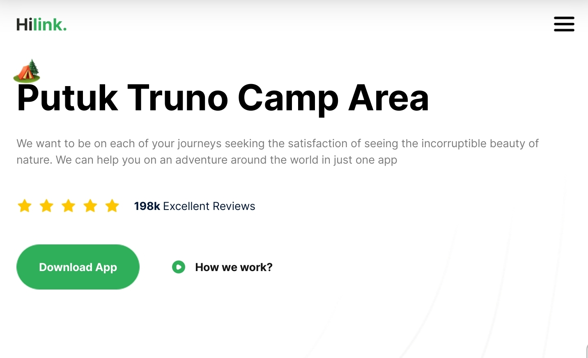
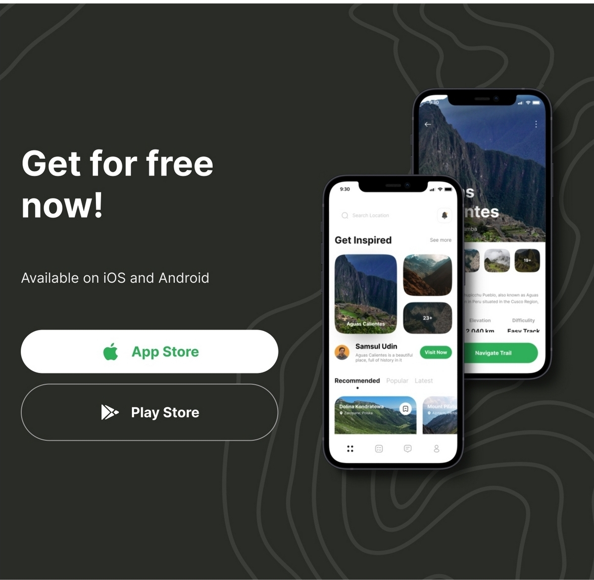
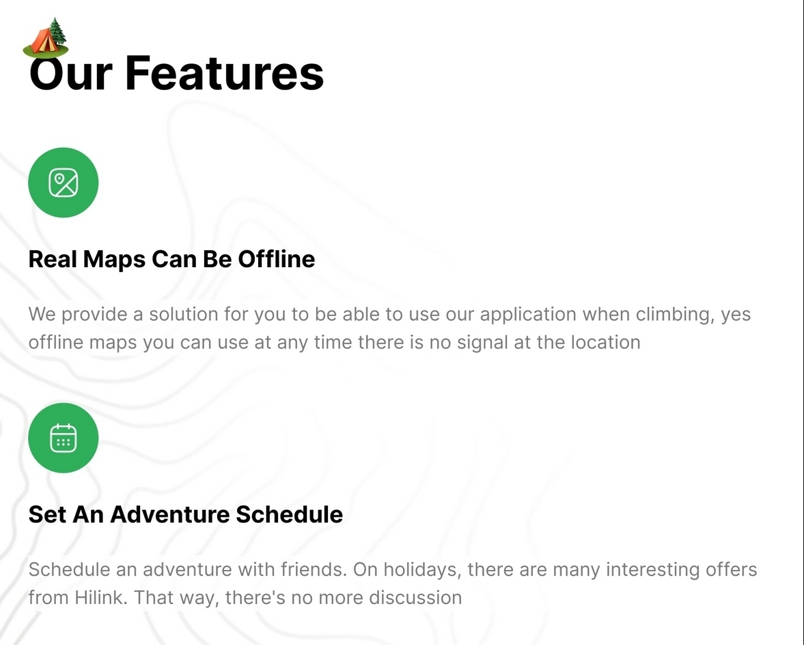
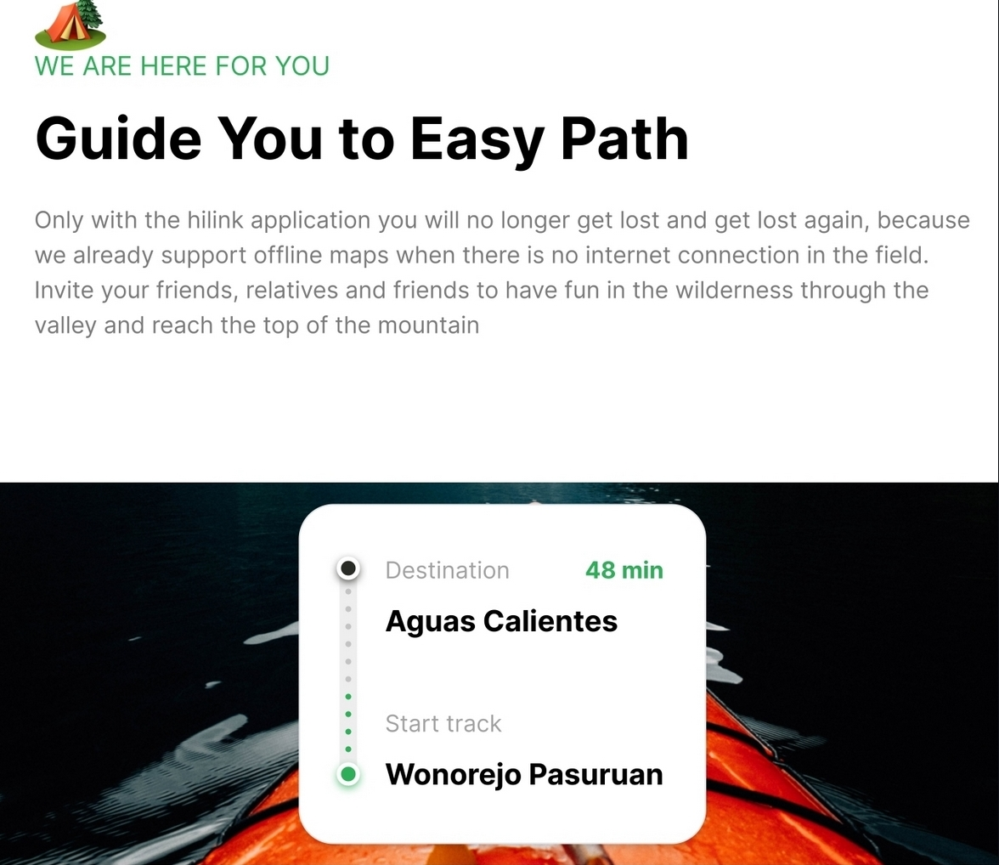
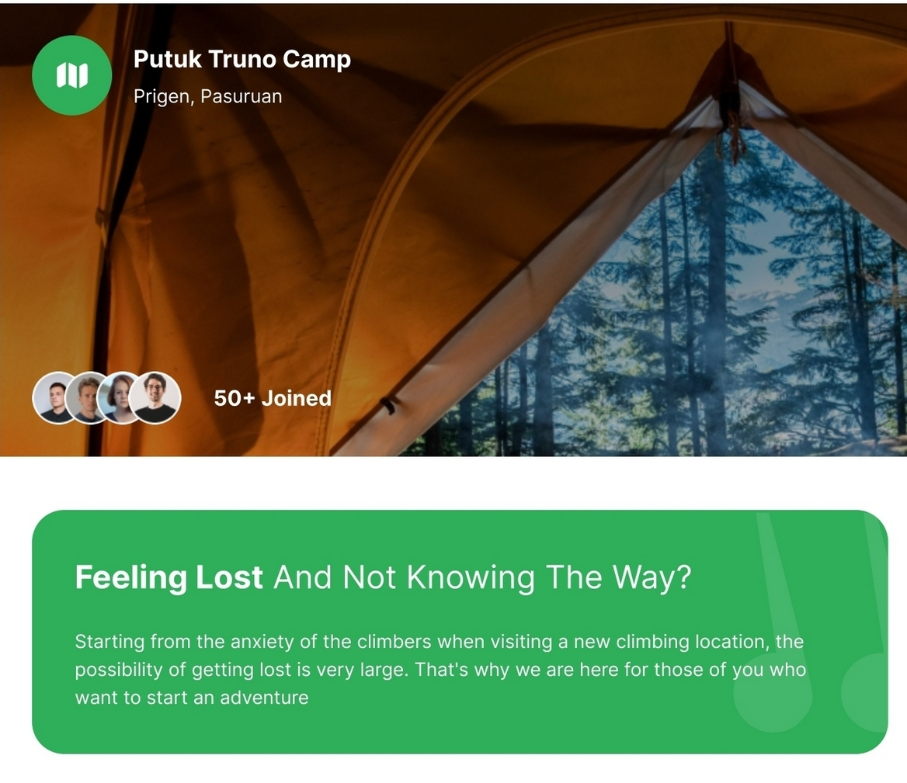
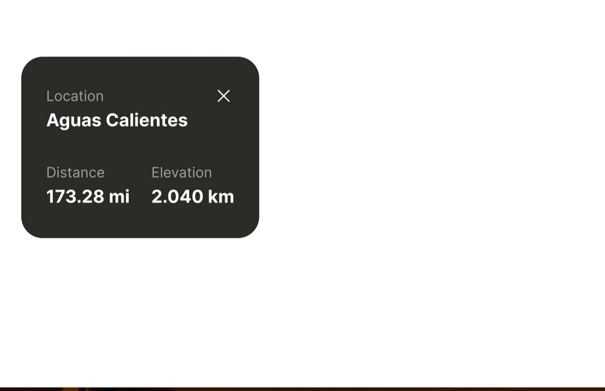

# Travel App

Travel App - Built with Next.js, TailwindCSS, and TypeScript, this landing page not only looks great but also serves as a hands-on project to reinforce one's understanding of these technologies. 
## Functionalities

👉 **Appealing Hero Section**: Visually striking hero section that captures attention and sets the tone for the website

👉 **Camp Exploration Section**: Showcase various camps in a dedicated section, allowing users to explore different options.

👉 **Engaging Travel Guide Section**: A compelling travel guide section with informative content and captivating visuals.

👉 **Feature-Rich Section**: A complex and feature-rich section offering advanced functionalities or in-depth information.

👉 **Call to Action for Mobile Apps**: A call-to-action section encouraging users to explore the mobile app version, complete with download links.

👉 **Footer**: Comprehensive footer section containing site and social media links for easy navigation and connectivity.

and many more, including code architecture and reusability 

## Technologies Used

- **React**: Frontend framework for building dynamic and interactive user interfaces.
- **Next.Js**: You know!!!!
- **vite** : a build tool that aims to provide a faster and leaner development experience for modern web projects
- 
## Screenshots

## Getting Started

To run the project locally, follow these steps:

1. Clone the repository: `git clone <repository_url>`
2. Navigate to the project directory: `cd travel`
3. Install dependencies: `npm install`
4. Start the development server: `npm run dev`
